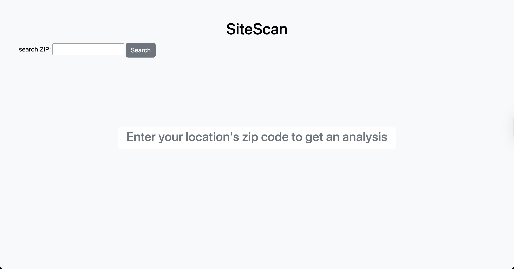
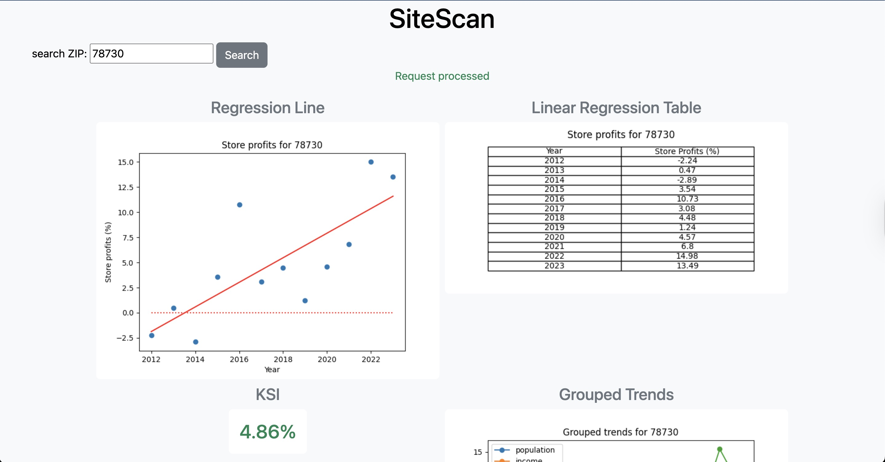

# SiteScan

## Overview
A financial forecasting application that assists in evaluating location suitability for expanding store operations. 


## Installation and running environment
- Required libraries: <br/>


!Make sure that you have Python locally installed: https://www.python.org/downloads/

1. Download project files using git clone:
````
$ git clone https://github.com/Lawsan92/SiteScan.git
````

2. Navigate to the project's root repository:
```
$ cd .../SiteScan
```
3. Open a Python virtual environment (command syntax may vary based on your computer's OS and Python version):
```aiignore
python3 -m venv path/to/venv
```
4. Install the following Python libraries in your virtual environment:
```aiignore
$ python3 -m pip install Django matplotlib datacommons_client scipy pandas mlxtend
```
5. Run the Django server: 
```aiignore
$ MPLBACKEND=Agg python manage.py runserver
```
The 
``MPLBACKEND=Agg`` flag allows the matplotlib library to run in "headless mode". This prevents the Django server from crashing.

Your terminal window should now display logs indicating that the app server is running
```aiignore
Watching for file changes with StatReloader
Performing system checks...

System check identified no issues (0 silenced).

You have 18 unapplied migration(s). Your project may not work properly until you apply the migrations for app(s): admin, auth, contenttypes, sessions.
Run 'python manage.py migrate' to apply them.
Month XX, 202X - 00:00:00
Django version 5.2.X, using settings 'SiteScan.settings'
Starting development server at http://127.0.0.1:8000/
Quit the server with CONTROL-C.

```

## Demonstration

Enter a valid zip code on the form, and the dashboard will populate with the following financial data:

- A linear regression plot for store profits, dating the past 12 years.
- A table with yearly data point values.
- A KSI value for the linear progression (the KSI is the mean of the datapoints in this case).
- A merged trend dataset that illustrates the data category trends used to compute the store profits regression line.

